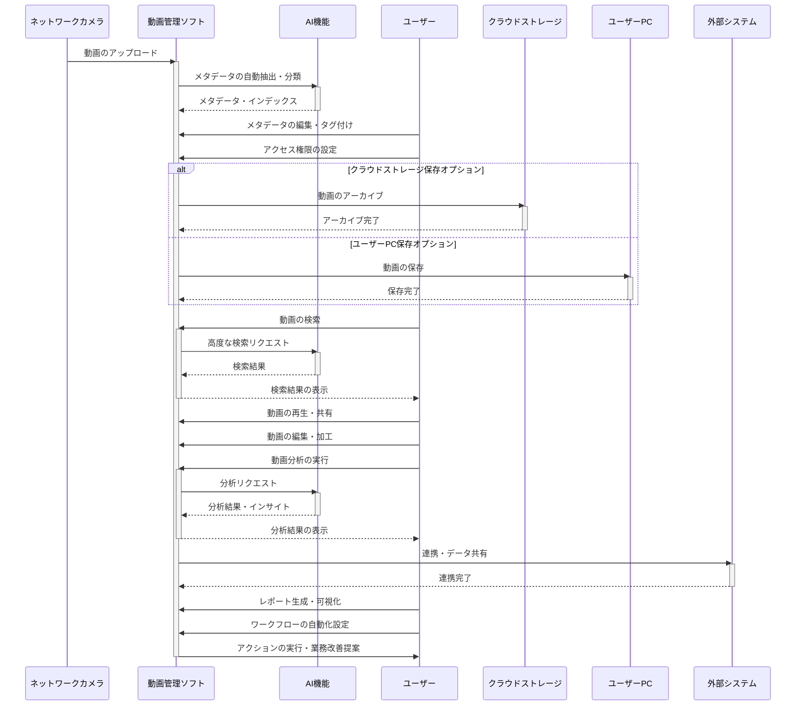
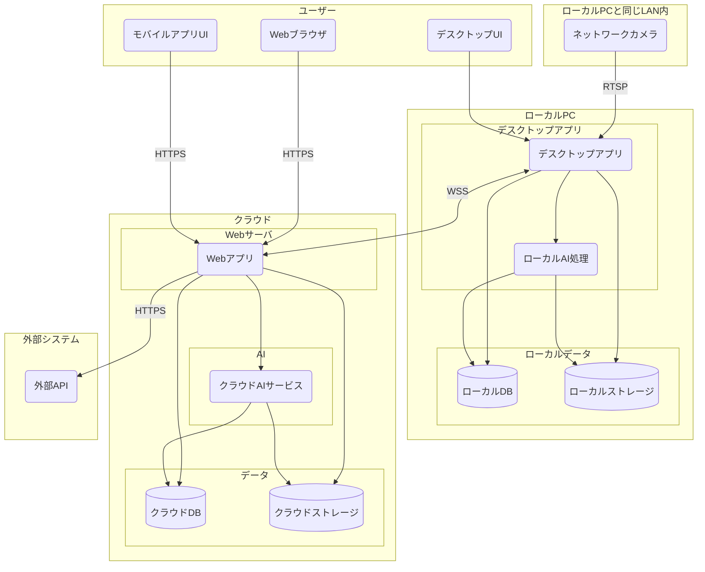

# 要件定義書: 動画管理ソフト 
---
 

# 作成記録
---
- 作成日時: 2024/5/7 野田大一郎  
- 更新日時: 2024/5/24 野田大一郎
 

# 概要
---
このドキュメントは、動画管理ソフトの要件定義書である。
 

# 対象読者
このドキュメントは動画管理ソフトの開発を担当するエンジニア用である。
---
 

# 目的
---
動画管理ソフトの要件を明確化し、開発の指針とする。
 

# 内容
---
 

# 背景
- 製造業、小売業、医療、教育、建設業など幅広い業界でネットワークカメラの導入が進んでいる
- ネットワークカメラから大量の動画データが発生しているが、その管理に課題を抱えている企業が多い
- 既存の動画管理ソフトウェアは高機能だが高価格であり、導入のハードルが高い
- 動画データを活用したいというニーズはあるが、コスト面から実現できていない企業が存在する

 

# 既存ソフトウェア調査
## 動画管理ソフトウェアの一般的な機能

- 動画のアップロード、管理、再生機能
- メタデータ編集、タグ付け、カテゴリ分類機能
- 動画検索機能(日時、カメラ位置など高度な検索条件に対応)
- サムネイル表示、プレビュー機能
- ユーザー/グループ管理とアクセス権限設定機能
- クラウドストレージとの連携、動画のアーカイブ機能
- 動画の共有機能(ソーシャルメディアやリンク共有)
- 動画分析機能(視聴回数、視聴時間など)
- API連携機能(外部システムとの連携)

## 動画管理ソフトウェアが高額な理由

- 大量の動画データを扱うための高性能なストレージやサーバーリソースが必要
- 動画のエンコーディングや変換に高い処理能力を要する
- 高度な検索機能やメタデータ管理機能の実装コストが高い
- ユーザー認証やアクセス制御など、セキュリティ対策のコストがかかる
- クラウドストレージやCDNとの連携コストが発生する
- 企業向けのサポートやカスタマイズ対応が必要

## 動画管理ソフトウェアの市場規模とターゲット

- 2023年の世界の動画管理ソフトウェア市場は約60億ドルと推定される
- 年率約15%の成長が見込まれており、2028年には120億ドル市場に達すると予測されている
- ターゲットは製造業、小売業、医療、教育、メディア/エンターテインメント業界など、動画活用ニーズの高い企業
- 中小企業からエンタープライズ向けまで幅広いユーザー層がある

市場は成長が見込まれており、ユーザーニーズに合わせた適切な機能と価格設定が重要となります。

## 主要ベンダーとシェア

- Panopto (11% シェア)
- Kaltura (10% シェア) 
- Qumu (8% シェア)
- Brightcove (7% シェア)
- VBrick (6% シェア)
- その他 (58% シェア)

## 価格帯
主要な動画管理ソフトウェアベンダーの価格帯は以下の通りです。

Panopto:
- スタートモデルがユーザー数1000人までで年額470万円
- 利用者数がライセンスのカウント対象
- 動画作成数や容量に制限はなし

Kaltura:
- 価格は非公開ですが、ユーザー数、ストレージ容量、機能などに応じてカスタマイズされる
- 教育機関向けと企業向けでプランが異なる

Brightcove:
- 具体的な価格は公開されていませんが、マーケティング向けとエンタープライズ向けの2つのプランがあります
- 動画ポータルサイト作成、ソーシャル配信、データ分析などの機能に応じた価格設定

VBrick:
- 価格は非公開ですが、ユーザー数やストレージ容量に応じた従量課金制

このように、主要ベンダーの価格は一概に言えませんが、ユーザー数、機能、容量などに応じて数百万円から数千万円の年額が一般的です。中小企業向けの低価格プランも用意されている場合があります。

 

# ターゲットユーザーの選定
## ターゲットユーザー層

本ソフトウェアのターゲットユーザー層は以下の通りです。

### 製造業

- 工場内の製造ラインや設備の監視にネットワークカメラを多数設置している
- 製品の品質管理や工程の確認のため、大量の動画データが発生する
- 動画データの一元管理と長期保存が必要

### 小売業 

- 店舗内の防犯や業務監視のためにネットワークカメラを設置している
- 動画データを活用した業務改善や事故原因の特定が求められる
- 機密性の高い動画データがあり、アクセス制御が必要

### 医療機関

- 手術室や病棟にネットワークカメラを設置し、医療行為を記録している
- 動画データを医療スタッフの研修や事例検討に活用したい
- 個人情報保護の観点から、動画データの厳重な管理が求められる

### 教育機関

- 授業の録画や学生の活動記録のためにネットワークカメラを使用している
- 動画データを授業資料や学習教材として活用したい
- 動画データの分類と検索機能が必要

### 建設業・インフラ管理

- 建設現場や設備の監視にネットワークカメラを設置している
- 工事の進捗確認や設備の保守点検に動画データを活用したい
- 長期間の動画データ保存と、現場間での共有機能が求められる

上記のような業種・業界において、ネットワークカメラの活用が進み、大量の動画データの管理ニーズが高まっています。本ソフトウェアはこれらのユーザー層を主なターゲットとします。

 

# ターゲットユーザーの状況
- 業務でネットワークカメラを多数設置し、大量の動画データが日々蓄積されている
- 動画データの管理が手作業で非効率的である  
- 必要な動画データを見つけるのが困難である
- 動画データの長期保存とアーカイブ化が課題となっている
- 機密性の高い動画データがあり、セキュリティ対策が必要である

 

# ターゲットユーザーの解決したい課題
- 大量の動画データを一元的に管理したい
- 動画データを効率的に検索できるようにしたい
- 動画データを長期間保存し、アーカイブ化したい  
- 動画データへのアクセスを適切に制御したい

 

# ターゲットユーザーがこのソフトウェアを使う理由
ターゲットユーザーは、以下の理由から本ソフトウェアを使用すると考えられます。

- 業務で発生する大量の動画データを効率的に一元管理できるため
- 必要な動画データを日時、カメラ位置などの条件で簡単に検索できるため
- 動画データを長期間保存し、クラウドストレージとの連携でアーカイブ化できるため
- 機密性の高い動画データに対して、ユーザー/グループ単位でアクセス権限を設定できるため
- APIを介して既存システムと連携でき、業務フローに組み込めるため

本ソフトウェアは、ネットワークカメラから発生する大量の動画データを、効率的に管理・検索・保存・セキュリティ対策ができる包括的なソリューションを提供します。ターゲットユーザーはこれらの機能を活用することで、動画データの利活用と適切な管理を実現でき、業務の生産性と効率性を大幅に向上させることができます。

 

# AIを活用することで可能になる、ユーザーの仕事
このソフトウェアにAIの機能が追加されることで、ユーザーは以下のような仕事ができるようになります。

- 動画データの自動分類・タグ付け
- 動画内の人物・物体・テキストの自動認識と検索
- 動画内の特定のシーンや出来事の自動検出
- 動画データからの自動要約作成
- 動画データの自動翻訳や字幕付与
- 動画データの自動編集や加工

AIを活用することで、従来人手で行っていた動画データの分析・加工・管理作業を自動化・効率化できます。ターゲットユーザーは、AIによる高度な動画データ処理を活用することで、以下のようなジョブを実施できるようになります。

- 動画データの価値の最大化(分析・編集・加工による付加価値創出)
- 動画データの利活用の促進(検索性・視認性の向上)
- 動画データ関連業務の生産性向上(自動化による効率化)
- 新しい動画データ活用サービスの創出(AIを活用した新しいソリューション)

つまり、AIの活用により、単なる動画データの管理・保存を超えて、動画データそのものの価値を高め、ビジネス活用を促進するジョブが実施可能になります。

## 製造業
- 製造ラインの動画から製品の欠陥や異常動作を自動検出
- 作業員の動作分析による作業効率の改善提案
- 設備の稼働状況の自動モニタリングと予兆保全

## 小売業
- 店舗内の人物動線分析による売り場レイアウトの最適化
- 不審者や万引き行為の自動検知とアラート通知
- レジ周りの動画分析による会計処理の効率化

## 医療機関
- 手術動画からの自動インデックス作成と重要場面の抽出
- 患者の状態変化の自動検知とナースコール
- 医療機器の操作ログ動画の自動分析とインシデント防止

## 教育機関
- 授業動画の自動字幕付与と要約作成
- 学生の受講状況や理解度の自動分析とフィードバック
- 教育コンテンツの自動レコメンドと個別最適化

## 建設業・インフラ管理
- 工事の進捗状況の自動検知と報告書作成
- 建機の稼働状況の自動モニタリングと異常検知
- インフラ設備の劣化診断と補修要否の自動判定

このように、AIを活用することで、各業界特有の動画データ分析ニーズに対応した高度なソリューションを提供できるようになります。これにより、ターゲットユーザーは業務の自動化・効率化だけでなく、新たな価値創出やビジネス変革を実現できるようになります。本ソフトウェアは、AIを活用した動画データ分析プラットフォームとして、ユーザーのビジネス課題解決を強力に支援します。

 

# 機能要件
## 動画データの一元管理機能
- 動画の取り込み、管理、再生機能
- サムネイル表示、メタデータ自動抽出・編集機能
- AIによる動画内の人物・物体・テキストの自動認識とインデックス作成

## 動画データの高度検索機能  
- AIによる自動タグ付け、カテゴリ分類機能
- 自然言語処理を用いた柔軟な検索条件設定機能(日時、カメラ位置、シーン、出来事など)
- 類似動画検索、重要シーン検出機能

## 動画データの長期保存・アーカイブ機能
- クラウドストレージとのシームレスな連携機能
- 動画データの自動アーカイブ・階層化ストレージ機能  
- ストレージコスト最適化機能

## 動画データのセキュリティ・プライバシー保護機能
- きめ細かなユーザー/グループ管理とアクセス権限設定機能
- 動画データの暗号化、改ざん防止機能
- 個人情報の自動検知・マスキング機能

## システム連携・自動化機能
- 豊富なAPIによる外部システム連携機能
- RPA連携による動画関連業務の自動化機能
- 動画を起点としたワークフロー自動化機能

## AIを活用した付加価値機能
- 動画要約・ダイジェスト自動生成機能
- 動画からのテキスト書き起こし・翻訳・字幕付与機能
- 異常検知、予兆検知、変化検知などのAI分析機能
- 業界・業務に特化したAIモデルのカスタマイズ機能

## データ分析・レポーティング機能
- 動画の利用状況や傾向の可視化・レポーティング機能
- ユーザーアクションや視聴履歴の分析機能
- ROI測定や課題発見のための分析ダッシュボード機能

## 動画保存先の選択機能
- ユーザーのPCに動画を保存する機能
- 従量課金でユーザーのデータをクラウドに保存するオプション機能

 

# 機能一覧
## 基本機能
1. ネットワークカメラとの接続・動画受信
2. 受信した動画データの変換・エンコーディング
3. 動画のアップロード、管理、再生
4. サムネイル表示、メタデータ自動抽出・編集
5. 動画検索(日時、カメラ位置など)
6. ユーザー/グループ管理とアクセス権限設定 
7. 動画保存先の選択機能
   - ユーザーのPCに動画を保存する機能
   - 従量課金でユーザーのデータをクラウドに保存するオプション機能
8. クラウドストレージとの連携、自動アーカイブ・階層化ストレージ
9. 動画の共有(リンク共有など)
10. 動画分析(視聴回数、視聴時間など)
11. 豊富なAPIによる外部システム連携

## AI機能
1. 動画内の人物・物体・テキストの自動認識
2. 自動タグ付け、カテゴリ分類
3. 自然言語処理を用いた柔軟な検索
4. 類似動画検索、重要シーン検出
5. 動画要約・ダイジェスト自動生成
6. 動画からのテキスト書き起こし・翻訳・字幕付与
7. 異常検知、予兆検知、変化検知などのAI分析
8. 業界・業務に特化したAIモデルのカスタマイズ

## セキュリティ・プライバシー保護機能 
1. 動画データの暗号化、改ざん防止
2. 個人情報の自動検知・マスキング

## 自動化・効率化機能
1. RPA連携による動画関連業務の自動化
2. 動画を起点としたワークフロー自動化
3. ストレージコスト最適化

## データ分析・レポーティング機能
1. 動画の利用状況や傾向の可視化・レポーティング
2. ユーザーアクションや視聴履歴の分析  
3. ROI測定や課題発見のための分析ダッシュボード

 

# ユーザーの業務フロー

 

# 物理構成図
## クラウドとデスクトップアプリを使用するパターン

 

# 使用フレームワーク及びプログラミング言語
## デスクトップアプリケーション
### フロントエンド
- プログラミング言語: Dart
- フレームワーク: Flutter
- 実行ファイルの作成: Flutterでビルド

### バックエンド
- プログラミング言語: Python
- フレームワーク: FastAPI
- データベース: SQLite
- 動画ソフトウェア: FFmpeg
- 実行ファイルの作成: nuitka
- AI推論: Onnx

### インストーラーの作成
- フレームワーク: Flutter
  - assetディレクトリにバックエンドの実行ファイルをおいた状態でFlutterでビルドしバックエンドの実行ファイルをFlutterパッケージに同梱する。

## モバイルアプリ
### フロントエンド
- プログラミング言語: Dart
- フレームワーク: Flutter

### バックエンド
※クラウド側で実装する

## クラウド
### フロントエンド
- プログラミング言語: Dart
- フレームワーク: Flutter

### バックエンド
- プログラミング言語: Python
- フレームワーク: FastAPI
- データベース: PostgreSQL
- メッセージキュー: Kafka
- 動画ソフトウェア: FFmpeg
- コンテナ: Docker
- AI学習: Databricks
    - 機械学習フレームワーク: 
        - PyTorch
        - ONNX (Open Neural Network Exchange)
    - 画像処理ライブラリ: 
        - OpenCvSharp
        - Pytorch Vision
    - 自然言語処理ライブラリ: 
        - NTextCat
        - Pytorch NLP

### インフラ
- クラウドプラットフォーム: Microsoft Azure
  - ストレージ: ADLS
  - データベース: Azure Database for PostgreSQL
  - コンテナオーケストレーション: Azure Kubernetes Service (AKS)
  - 分析: Azure Databricks
  - HP: App Service
- インフラ構成管理: Terraform
- CI/CD: GitHub Actions

 
 

# MVP案
## 指定した範囲内に人が検出された場合にアラートを出す

### 背景
多くの業界でネットワークカメラが導入され、監視やセキュリティの強化が図られています。しかし、現状ではカメラ映像を人が常時監視する必要があり、人的リソースの負担が大きいです。また、異常事態の早期発見が難しく、対応が遅れることがあります。

### 課題
- 人的リソースの負担が大きい
- 異常事態の早期発見が難しい
- 監視の効率化が求められている

### 解決策
AI技術を活用し、指定した範囲内に人が検出された場合に自動的にアラートを出す機能を実装します。これにより、監視業務の効率化と異常事態の早期発見が可能となります。

### 構想
1. **指定範囲の設定**:
   - ユーザーが監視したい範囲をカメラ映像上で指定できるインターフェースを提供します。

2. **AIによる人物検出**:
   - AIモデルを用いて、指定範囲内に人物が入った場合にリアルタイムで検出します。

3. **アラート機能**:
   - 人物が検出された際に、即座にアラートを発出します。アラートはメール、SMS、アプリ通知など複数の方法で送信可能とします。

4. **ログとレポート**:
   - 検出された人物のログを保存し、後で確認できるようにします。また、定期的なレポートを生成し、監視状況を可視化します。

この機能により、監視業務の効率化と異常事態の早期発見が実現し、セキュリティの強化に貢献します。
