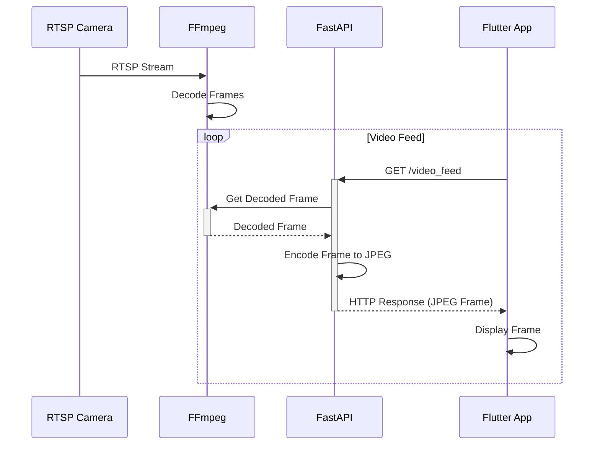

# 基本設計書:  ネットワークカメラとの接続・動画受信
<br>

# 作成記録
---
* 作成日時 2024/5/7 野田大一郎
* 更新日時 2024/5/11 野田大一郎
<br>

# 概要
---
* このドキュメントはネットワークカメラとの接続・動画受信の基本設計書である。
<br>

# 対象読者
---
* このドキュメントはネットワークカメラとの接続・動画受信の基本設計書を確認したいエンジニア用である。
<br>

# 目的
---
* ネットワークカメラとの接続・動画受信の基本設計を記載する。
<br>

# 内容
---
# 背景:
- RTSPストリームをFlutterアプリで直接表示することは、安定性やパフォーマンスの面で課題がある
- サーバーサイドでRTSPストリームを受信し、HTTPベースのAPIとして提供することで、クライアントアプリの実装を簡素化できる

# 課題:
- RTSPストリームを安定して受信し、リアルタイムにデコードする必要がある
- デコードした動画フレームをHTTPレスポンスとして効率的に配信する必要がある
- Flutterアプリから動画フレームを取得し、スムーズに表示する必要がある

# 解決策:
1. FFmpegを使用してRTSPストリームを受信し、動画フレームをデコードする
2. FastAPIを使用してREST APIを構築し、デコードした動画フレームをレスポンスとして返す
3. Flutterアプリから定期的にREST APIにリクエストを送信し、動画フレームを取得する
4. Flutterアプリ内で動画フレームを表示する

# 構成図:


# サンプルコード:

FastAPI (Python):
```python
from fastapi import FastAPI
import cv2
import ffmpeg

app = FastAPI()

# RTSPストリームのURL
RTSP_URL = "rtsp://example.com/stream"

# FFmpegを使用してRTSPストリームを開く
stream = ffmpeg.input(RTSP_URL)

@app.get("/video_feed")
async def video_feed():
    # RTSPストリームからフレームを読み込む
    frame = stream.output(format='rawvideo', pix_fmt='bgr24').run(capture_stdout=True)
    
    # フレームをJPEG形式にエンコード
    _, encoded_frame = cv2.imencode('.jpg', frame)
    
    # レスポンスとしてJPEGフレームを返す
    return Response(content=encoded_frame.tobytes(), media_type="image/jpeg")
```

Flutter (Dart):
```dart
import 'package:flutter/material.dart';
import 'package:http/http.dart' as http;

class VideoFeedScreen extends StatefulWidget {
  @override
  _VideoFeedScreenState createState() => _VideoFeedScreenState();
}

class _VideoFeedScreenState extends State<VideoFeedScreen> {
  late Future<http.Response> _videoFeed;

  @override
  void initState() {
    super.initState();
    _videoFeed = fetchVideoFeed();
  }

  Future<http.Response> fetchVideoFeed() async {
    return await http.get(Uri.parse('http://localhost:8000/video_feed'));
  }

  @override
  Widget build(BuildContext context) {
    return Scaffold(
      appBar: AppBar(title: Text('Video Feed')),
      body: FutureBuilder<http.Response>(
        future: _videoFeed,
        builder: (context, snapshot) {
          if (snapshot.hasData) {
            return Image.memory(snapshot.data!.bodyBytes);
          } else if (snapshot.hasError) {
            return Text('Error: ${snapshot.error}');
          }
          return CircularProgressIndicator();
        },
      ),
    );
  }
}
```

以上のコードでは、FastAPIを使用してRTSPストリームからデコードした動画フレームをHTTPレスポンスとして提供し、Flutterアプリから定期的にそのAPIにリクエストを送信して動画フレームを取得・表示しています。これにより、RTSPストリームをFlutterアプリで安定して表示することができます。

Citations:
[1] https://www.mediaspip.net/spip.php?age=365&id_syndic=98&lang=fr&page=sedna&recherche=link
[2] https://stackoverflow.com/questions/63667466/video-streaming-app-using-fastapi-and-opencv
[3] https://www.upwork.com/hire/iptv-freelancers/
[4] https://www.upwork.com/hire/ffmpeg-freelancers/
[5] https://www.upwork.com/hire/video-streaming-freelancers/
[6] https://zenodo.org/records/6854770/files/repo_list.txt?download=1
[7] https://github.com/gaahrdner/starred/blob/master/README.md
[8] https://github.com/fscorrupt/awesome-stars
[9] https://wiki.nikiv.dev/web/webrtc
[10] https://stackoverflow.com/questions/tagged/hikvision?tab=Active
[11] https://formulae.brew.sh/formula/
[12] https://github.com/r0xsh/my-awesome-stars
[13] https://github.com/gaahrdner/starred
[14] https://github.com/maguowei/awesome-stars
[15] https://qiita.com/j5c8k6m8/items/b78a14cb8e1fce4ef6d8
[16] https://pydigger.com/keywords
[17] https://qiita.com/j5c8k6m8/items/5601e2f8fbe16887de68
[18] https://www.upwork.com/hire/gstreamer-freelancers/
[19] https://stackoverflow.com/questions/tagged/hikvision?sort=votes
[20] https://top1000repos.com