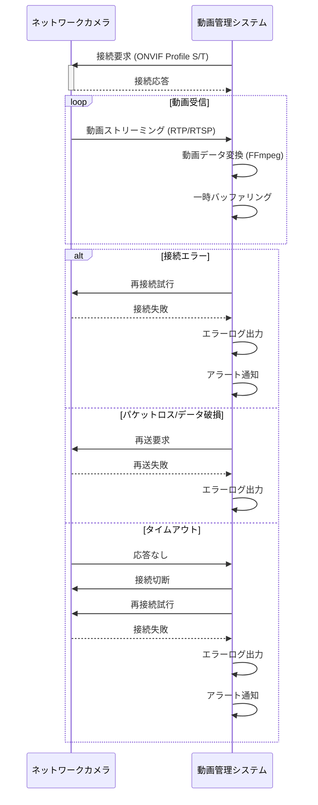

# 基本設計書:  ネットワークカメラとの接続・動画受信
 

# 作成記録
---
* 作成日時 2024/5/7 野田大一郎
* 更新日時
 

# 概要
---
* このドキュメントはネットワークカメラとの接続・動画受信の基本設計書である。
 

# 対象読者
---
* このドキュメントはネットワークカメラとの接続・動画受信の基本設計書を確認したいエンジニア用である。
 

# 目的
---
* ネットワークカメラとの接続・動画受信の基本設計を記載する。
 

# 内容
---
# ネットワークカメラとの接続
1. ネットワークカメラはRJ-45（10Base-T/100Base-TX）インターフェースを介して接続する
2. ネットワークカメラとの通信プロトコルはIPv4、HTTP、HTTPS、TCP、UDP、RTP、RTSPを使用する
3. ネットワークカメラとの接続はONVIF Profile S、Profile Tに準拠する
4. ネットワークカメラとの接続時のセキュリティ対策として、通信の暗号化、ユーザー認証、アクセス制御を実装する

 

# 動画受信
1. ネットワークカメラから受信する最大画像サイズは3840×2160（4K解像度）とする
2. 動画のエンコーディングフォーマットはH.265（Mainプロファイル）とH.264（Main/Highプロファイル）に対応する
3. 動画のフレームレートは最大30fpsまで対応する
4. 動画のビットレートは可変ビットレート（VBR）に対応し、ユーザーが設定可能とする
5. 受信した動画データはFFmpegを使用してシステムが指定するフォーマットに変換し、一時的にバッファリングする

 

# エラー処理
1. ネットワークカメラとの接続エラーが発生した場合、再接続を試行し、一定回数失敗した場合はエラーログを出力してアラートを通知する
2. 動画受信中にパケットロスやデータ破損が検出された場合、再送要求を行い、一定時間受信できない場合はエラーログを出力する
3. ネットワークカメラからの応答がタイムアウトした場合、接続を切断し、再接続を試行する。一定回数失敗した場合はエラーログを出力してアラートを通知する

以上の基本設計に基づき、ネットワークカメラとの安定した接続と高品質な動画受信を実現します。FFmpegを使用して受信した動画データを効率的に変換処理します。セキュリティ対策とエラー処理により、システムの信頼性と可用性を確保します。

 

# シーケンス図
