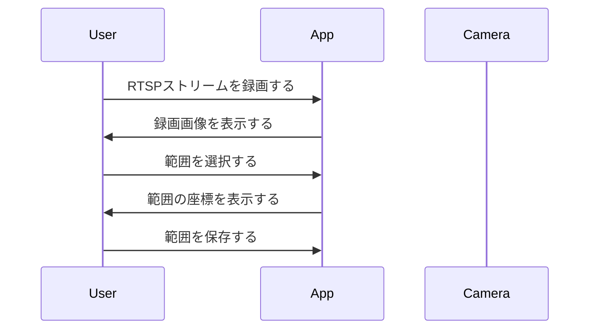

# 基本設計書:  指定範囲での人物検知
<br>

# 作成記録
---
* 作成日時 2024/6/8 野田大一郎
* 更新日時
<br>

# 概要
---
* このドキュメントは指定範囲での人物検知の基本設計書である。
<br>

# 対象読者
---
* このドキュメントは指定範囲での人物検知の基本設計書を確認したいエンジニア用である。
<br>

# 目的
---
* 指定範囲での人物検知の基本設計を記載する。
<br>

# 内容
---
# 背景
多くの業界でネットワークカメラが導入され、監視やセキュリティの強化が図られています。しかし、現状ではカメラ映像を人が常時監視する必要があり、人的リソースの負担が大きいです。また、異常事態の早期発見が難しく、対応が遅れることがあります。

# 課題
- 人的リソースの負担が大きい
- 異常事態の早期発見が難しい
- 監視の効率化が求められている

# 解決策
AI技術を活用し、指定した範囲内に人が検出された場合に自動的にアラートを出す機能を実装します。これにより、監視業務の効率化と異常事態の早期発見が可能となります。

# 構想
1. **指定範囲の設定**:
   - ユーザーが監視したい範囲をカメラ映像上で指定できるインターフェースを提供します。

2. **AIによる人物検出**:
   - AIモデルを用いて、指定範囲内に人物が入った場合にリアルタイムで検出します。

3. **アラート機能**:
   - 人物が検出された際に、即座にアラートを発出します。アラートはメール、SMS、アプリ通知など複数の方法で送信可能とします。

4. **ログとレポート**:
   - 検出された人物のログを保存し、後で確認できるようにします。また、定期的なレポートを生成し、監視状況を可視化します。

この機能により、監視業務の効率化と異常事態の早期発見が実現し、セキュリティの強化に貢献します。

# アプリケーションの種類
* デスクトップアプリケーション

# ソフトウェア
* flutter
* FastAPI

# ハードウェア
* ネットワークカメラ

# 具体的な構想
## 1. ユーザーインターフェース
ユーザーが監視したい範囲を指定するためのインターフェースを提供します。これには、カメラ映像上で範囲をドラッグして選択する機能が含まれます。

## 2. AIモデルの選定とトレーニング
人物検出のためのAIモデルを選定し、必要に応じてトレーニングを行います。一般的には、YOLO（You Only Look Once）やSSD（Single Shot MultiBox Detector）などのモデルが使用されます。

## 3. リアルタイム検出
カメラ映像をリアルタイムで解析し、指定範囲内に人物が入った場合に検出します。これには、映像ストリームを処理するための高速な計算リソースが必要です。

## 4. アラートシステム
人物が検出された際に、即座にアラートを発出します。アラートはメール、SMS、アプリ通知など複数の方法で送信可能とします。

## 5. ログとレポート
検出された人物のログを保存し、後で確認できるようにします。また、定期的なレポートを生成し、監視状況を可視化します。

## 6. セキュリティ対策
システム全体のセキュリティを確保するために、データの暗号化やアクセス制御を実装します。

## 7. スケーラビリティ
システムが多くのカメラやユーザーに対応できるように、スケーラビリティを考慮した設計を行います。クラウドサービスを利用して、必要に応じてリソースをスケールアップ/スケールダウンします。

## 8. テストとデプロイ
システム全体のテストを行い、バグや問題点を修正します。その後、プロダクション環境にデプロイします。

このようにして、指定範囲での人物検知システムを実現します。

# ユーザーインターフェースの設計
## 1. インターフェースの概要
ユーザーインターフェースは、ユーザーが直感的に操作できるように設計されます。以下の要素が含まれます。

### 1.1 メイン画面
- **カメラ映像表示エリア**: リアルタイムでカメラ映像を表示します。
- **指定範囲設定ツール**: ユーザーが監視したい範囲をドラッグして選択できるツールを提供します。
- **アラート表示エリア**: 検出された人物やアラートの履歴を表示します。

### 1.2 設定画面
- **カメラ設定**: 接続するカメラの設定を行います。
- **アラート設定**: アラートの送信方法（メール、SMS、アプリ通知など）を設定します。
- **ログとレポート設定**: ログの保存先やレポートの生成頻度を設定します。

## 2. ユーザーインターフェースの詳細設計
### 2.1 カメラ映像表示エリア
- **リアルタイム映像**: カメラからの映像をリアルタイムで表示します。
- **指定範囲の表示**: ユーザーが設定した監視範囲をオーバーレイ表示します。

### 2.2 指定範囲設定ツール
- **ドラッグ&ドロップ**: ユーザーがマウス操作で監視範囲を指定できるようにします。
- **範囲の調整**: 設定した範囲を後から調整できる機能を提供します。

### 2.3 アラート表示エリア
- **アラート履歴**: 検出された人物や発出されたアラートの履歴を一覧表示します。
- **詳細情報**: 各アラートの詳細情報（検出時刻、検出場所など）を表示します。

### 2.4 設定画面の詳細
- **カメラ設定**: カメラのIPアドレスや接続情報を入力するフォームを提供します。
- **アラート設定**: アラートの送信先や送信方法を選択するオプションを提供します。
- **ログとレポート設定**: ログの保存先ディレクトリやレポートの生成頻度を設定するオプションを提供します。

## 3. ユーザビリティの考慮
- **直感的な操作**: ユーザーが直感的に操作できるように、シンプルで分かりやすいインターフェースを設計します。
- **レスポンシブデザイン**: デスクトップだけでなく、タブレットやスマートフォンでも快適に操作できるようにします。
- **アクセシビリティ**: 色覚異常のユーザーにも配慮したカラーデザインや、キーボード操作に対応したインターフェースを提供します。

# 指定範囲設定ツール
## 概要
ユーザーが監視したい範囲を指定するためのインターフェースを提供します。これには、カメラ映像上で範囲をドラッグして選択する機能が含まれます。

## 実装方法
Flutterを使用して、ユーザーがドラッグ操作で矩形を描画できるウィジェットを作成します。以下にその基本的な実装例を示します。

```dart
import 'package:flutter/material.dart';

class RangeSelector extends StatefulWidget {
  @override
  _RangeSelectorState createState() => _RangeSelectorState();
}

class _RangeSelectorState extends State<RangeSelector> {
  Offset? _start;
  Offset? _end;

  @override
  Widget build(BuildContext context) {
    return GestureDetector(
      onPanStart: (details) {
        setState(() {
          _start = details.localPosition;
          _end = _start;
        });
      },
      onPanUpdate: (details) {
        setState(() {
          _end = details.localPosition;
        });
      },
      onPanEnd: (details) {
        // Handle the end of the drag, e.g., save the selected range
      },
      child: CustomPaint(
        painter: _RangePainter(_start, _end),
        child: Container(
          color: Colors.transparent,
        ),
      ),
    );
  }
}

class _RangePainter extends CustomPainter {
  final Offset? start;
  final Offset? end;

  _RangePainter(this.start, this.end);

  @override
  void paint(Canvas canvas, Size size) {
    if (start != null && end != null) {
      final paint = Paint()
        ..color = Colors.blue.withOpacity(0.5)
        ..style = PaintingStyle.fill;

      final rect = Rect.fromPoints(start!, end!);
      canvas.drawRect(rect, paint);
    }
  }

  @override
  bool shouldRepaint(covariant CustomPainter oldDelegate) {
    return true;
  }
}
```

このコードは、ユーザーがドラッグ操作で矩形を描画できるウィジェットを提供します。<br>`GestureDetector`を使用してドラッグ操作を検出し、`CustomPaint`を使用して矩形を描画します。

# シーケンス図
1. 録画する
2. 録画画像を表示する
3. 範囲を選択する
4. 範囲の座標を表示する
5. 範囲を保存する

