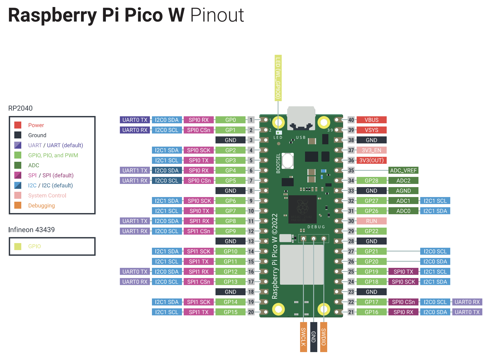

# 調査資料 - Raspberry Pi Picoでのサーボモータ制御方法
&nbsp;
# 作成記録
---
* 作成日時 2024/5/5 野田大一郎
* 更新日時
&nbsp;
# 概要
---
* このドキュメントはRaspberry Pi Picoでのサーボモータ制御方法の調査資料である。
&nbsp;
# 対象読者
---
* このドキュメントはRaspberry Pi Picoでのサーボモータ制御方法を確認したいエンジニア用である。
&nbsp;
# 目的
---
* Raspberry Pi Picoでのサーボモータ制御方法を記載する。
&nbsp;

# 内容
---
# ハードウェア構成
* Raspberry Pi Pico W
* Tower Pro SG90サーボモータ

# Raspberry Pi Pico W ピン配置


# 参考
* [Raspberry Pi Pico WとPWMでサーボを制御する](https://picockpit.com/raspberry-pi/ja/%E3%83%A9%E3%82%BA%E3%83%99%E3%83%AA%E3%83%BC%E3%83%91%E3%82%A4%E3%83%BB%E3%83%94%E3%82%B3w%E3%83%BB%E3%83%91%E3%83%AB%E3%82%B9%E5%B9%85%E5%A4%89%E8%AA%BF%E3%83%BBpwm%E3%81%AB%E3%82%88%E3%82%8B/)
* [【MicroPython】RaspberryPi Pico/Pico WでサーボモーターSG90を使う方法](https://tech-and-investment.com/raspberrypi-picow-12-servo/)

# 制御方法
Raspberry Pi PicoでTower Pro SG90サーボモータを制御するには、以下の手順で行うことができます。

## 1. 配線

SG90サーボモータとPicoを以下のように接続します。

- サーボモータのオレンジ色の信号線をPicoのGPIO 28ピンに接続
- サーボモータの赤い電源線をPicoのVBUS (5V)ピンに接続  
- サーボモータの茶色のGND線をPicoのGNDピンに接続

SG90の動作電圧は4.8V〜6Vなので、Picoの3.3V端子ではなく5V端子を使います。

## 2. プログラム

以下のMicroPythonコードでサーボモータを制御できます。

```python
from machine import PWM, Pin
from time import sleep

servo = PWM(Pin(28))
servo.freq(50)

angle_0 = int(2.5 / 20 * 65536)
angle_90 = int(1.5 / 20 * 65536)
angle_180 = int(0.5 / 20 * 65536)

servo.duty_u16(angle_0)
sleep(1)
servo.duty_u16(angle_90)
sleep(1)
servo.duty_u16(angle_180)
sleep(1)

servo.duty_u16(0)
```

ポイントは以下の通りです。

- PWM周波数は50Hzに設定
- SG90の制御パルス幅は0.5ms〜2.4msなので、これを16ビット(0〜65535)のduty比に変換
- 0度: 0.5ms = 2500/65535、180度: 2.4ms = 12000/65535 より、duty比は角度に比例して2500〜12000の範囲で変化させる

## 3. 動作範囲の調整

SG90の仕様上の動作角度は0〜180度ですが、個体差によっては端まで動かない場合があります。その場合は、servo_write関数内のduty比の計算式を調整します。例えば、

```python 
duty = int((degrees * 8000 / 180) + 3000)  # 例: 0度=3000, 180度=11000
```

のように、係数と切片の値を変更して動作範囲を狭めます。実際に動かして微調整すると良いでしょう。

以上の手順でRaspberry Pi PicoからSG90サーボモータを制御することができます。パルス幅の計算とPWM制御がポイントです。動作角度の調整も忘れずに行いましょう。